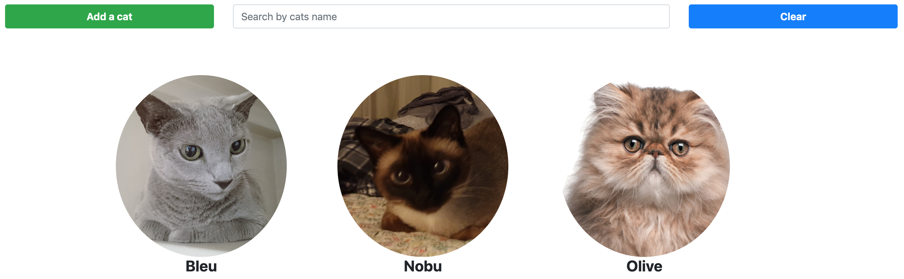

# CatDex
CatDex allows a user to keep track of all his or her cats (index). The user can also add, edit cat, and delete a cat.

Technologies used to create CatDex are: React, Redux, Ruby on Rails, PostgreSQL, AWS S3, HTML, and CSS/Bootstrap.

You can visit CatDex [here](https://catdex.herokuapp.com)! Or visit my portfolio site [here](https://davidyoon85.github.io)!

### Challenge
Jack owns so many cats that he can't keep track of all of them. He needs some way to keep track of all of his cats - almost like a Pokédex for cats.

### Requirements
Your web app should be able to complete the following tasks:

Add a new Cat (Name, Breed, Description, or anything else you think would be important)
Remove Cats
Edit Cats
List all of his Cats
Use Redux for state management and utilize frontend actions
